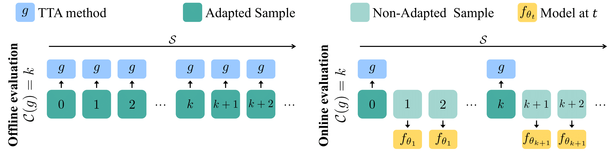

<!-- # Online_Test_Time_Adaptation -->
# Revisiting Test Time Adaptation Under Online Evaluation



This benchmark is a step towards standardizing the evaluation of Test Time Adaptation (TTA) methods. We have implementations of 14 different TTA methods from the literature. 

|Method |Paper| Code|
|------|-------|------|
|ETA and EATA|[(paper)](https://arxiv.org/abs/2204.02610)|[(code)](https://github.com/mr-eggplant/EATA)|
|SHOT and SHOT-IM|[(paper)](https://arxiv.org/abs/2002.08546)|[(code)](https://github.com/fiveai/LAME/blob/master/src/adaptation/shot.py)|
|TENT| [(paper)](https://openreview.net/pdf?id=uXl3bZLkr3c)|[(code)](https://github.com/DequanWang/tent)|
|SAR| [(paper)](https://openreview.net/forum?id=g2YraF75Tj)|[(code)](https://github.com/mr-eggplant/SAR)|
|PL|[(paper)](https://www.researchgate.net/publication/280581078_Pseudo-Label_The_Simple_and_Efficient_Semi-Supervised_Learning_Method_for_Deep_Neural_Networks)|[(code)](https://github.com/fiveai/LAME/blob/master/src/adaptation/pseudo_label.py)|
|TTAC-NQ|[(paper)](https://openreview.net/forum?id=g2YraF75Tj)|[(code)](https://github.com/Gorilla-Lab-SCUT/TTAC)|
|BN Adaptation|[(paper)](https://arxiv.org/pdf/2006.16971v1.pdf)|[(code)](https://github.com/bethgelab/robustness/tree/main/examples/batchnorm)|
|CoTTA|[(paper)](https://arxiv.org/abs/2203.13591)|[(code)](https://github.com/qinenergy/cotta)|
|AdaBN|[(paper)](https://arxiv.org/abs/1603.04779)|[(code)](https://github.com/erlendd/ddan)|
|MEMO| [(paper)](https://arxiv.org/abs/2110.09506)|[(code)](https://github.com/zhangmarvin/memo)|
|DDA|[(paper)](https://arxiv.org/abs/2207.03442)|[(code)](https://github.com/shiyegao/DDA)|
|Source|[(paper)](https://arxiv.org/abs/1512.03385)|-|
|LAME| [(paper)](https://openaccess.thecvf.com/content/CVPR2022/papers/Boudiaf_Parameter-Free_Online_Test-Time_Adaptation_CVPR_2022_paper.pdf)|[(code)](https://github.com/fiveai/LAME)|

We evaluate all considered methods with varying the rate in which the stream of data is revealing new batches for the TTA method.
We fixed the architecture to ResNet-50 throughout all our experimetns and used the `torchvision` pretrained weights.

## Environment Installation
To use our code, first you might need to install our environment through running:

```
conda env install -f environment.yml
```

## Datasets used for Evaluation
Our results are reported on 3 different datasets: ImageNet-C, ImageNet-R, and ImageNet-3DCC. 
All datasets are publicly available and can be downloaded from their corresponding repositories. 
- ImageNet-C: [here](https://github.com/hendrycks/robustness)
- ImageNet-R: [here](https://github.com/hendrycks/imagenet-r)
- ImageNet-3DCC: [here](https://github.com/EPFL-VILAB/3DCommonCorruptions)

For ImageNet-C and ImageNet-3DCC, the data should be organized as `PATH/COURRUPTION/SEVERITY/*`.

## Online Evaluation of TTA Methods
Our paper evaluates the efficacy of TTA methods when data arrives a stream with constant speed.
We simulate that by assuming that the rate in which the stream reveals new data is $\eta * r$ where $r$ is the speed of the forward pass of non-adapted model and $\eta \in [0, 1]$. Hence, as $\eta \rightarrow 0$, then all TTA methods will adapt to all revealed samples as the stream is revealing data in a very small rate.
As $\eta \rightarrow 1$, then the stream is revealing data in a fast rate penalizing slow TTA methods by allowing them to adapt on fewer samples.

## Evaluating TTA Methods
We considered two different evaluation schemes in our work: episodic evaluation and continual evaluation.
Episodic evaluation evaluates a given TTA method on a single domain shift, e.g. one corruption. 
Continual evaluation evaluates a given TTA method on a sequence of domain shifts continually without resetting the parameters of the model.
At last, we also considered single model evaluation. In this setup, a random prediction is assigned to all missed batches that TTA methods did not adapt to.

### Episodic Evaluation
To evaluate a TTA method under different stream speeds, run:
```
python main.py --eta [ETA] --method [METHOD] --dataset [DATASET] --corruption [CORRUPTION] --severity [SEVERITY] --imagenetc_path [PATH] --output [OUTPUT_PATH] --batch_size [BATCH_SIZE]
```
where
- ETA: is a float between 0 and 1 representing $\eta$ in our paper for varying the stream speed. Default value is $\eta = 1$ which corresponds to online evaluation.
- METHOD: is a TTA method which should belong to `['basic', 'tent', 'eta', 'eata', 'cotta', 'ttac_nq', 'memo', 'adabn', 'shot', 'shotim', 'lame', 'bn_adaptation', 'pl',  'sar', 'dda']`.
- DATASET: should belong to `[imagenetc, imagenetr, imagenet3dcc]`.
- CORRUPTION: is the type of corruption you would like to evaluate on. For ImageNet-C, the corruptions are `['gaussian_noise', 'shot_noise', 'impulse_noise', 'defocus_blur', 'glass_blur', 'motion_blur', 'zoom_blur', 'snow', 'frost', 'fog', 'brightness', 'contrast', 'elastic_transform', 'pixelate', 'jpeg_compression']` where for ImageNet-3DCC `['bit_error', 'color_quant', 'far_focus', 'flash', 'fog_3d', 'h265_abr', 'h265_crf', 'iso_noise', 'low_light', 'near_focus', 'xy_motion_blur', 'z_motion_blur']`. For ImageNet-R, do not pass the `--corruption`.
- SEVERITY: is an integer between 1 and 5 to determine how severe the corruption is. All our results are done with a severity of 5.
- PATH: is the path for for ImageNet-C dataset. The data should be in the format `PATH/COURRUPTION/SEVERITY/*`. If you are evaluating on ImageNet-3DCC or ImageNet-R, then replace `--imagenetc_path` with `--imagenet3dcc_path` or `--imagenetr_path`.
- OUTPUT: is the output path to save the results of the evaluation.
- BATCH_SIZE: is the batch size of the validation loader. For all of our experiments, we fixed the batch size to 64. 


### Continual Evaluation
To test a given TTA method under a continual sequence of domain shifts, run:
```
python main.py --exp_type continual --test_val --eta [ETA] --method [METHOD] --dataset [DATASET] --corruption [CORRUPTION] --severity [SEVERITY] --imagenetc_path [PATH] --output [OUTPUT_PATH]
```
Note that the main difference is passing `--exp_type continual`. 
- CORRUPTION: should belong to `['all', 'all_ordered']` where `all_ordered` sets the order of the corruptions similar to the one in Section 4.3 (Figure 3), and `all` shuffles all corruptions randomly. 
- `--test_val`: To evaluate on the clean validation set of ImageNet at the end of the continual evaluation.

All the remaining arguments follow our episodic evaluation.

### Single Model Experiments
To test a given TTA method in a single model evaluation scheme, following Section 4.6, run:
```
python main.py --single_model --eta [ETA] --method [METHOD] --dataset [DATASET] --corruption [CORRUPTION] --severity [SEVERITY] --imagenetc_path [PATH] --output [OUTPUT_PATH] --batch_size [BATCH_SIZE]
```
where all other arguments follow our episodic evaluation.

## Adding New TTA Methods
To add additional TTA methods, please follow the example in our basic wrapper `tta_methods/basic.py`. Note that each TTA method is required to have the non-adapted forward pass as the property `self.model`. This property will allow the online evaluation to pass batches that will not be adapted to the normal fowrward pass.
After adding your new method in `tta_methods` directory, please import it in `tta_methods/__init__.py` and add it to the `_all_methods` dictionary.
To test the efficacy of the new implemented method in the episodic evaluation scheme, run:
```
python main.py --eta [ETA] --method [METHOD] --dataset [DATASET] --corruption [CORRUPTION] --severity [SEVERITY] --imagenetc_path [PATH] --output [OUTPUT_PATH] --batch_size [BATCH_SIZE]
```
where [METHOD] should be the added key in the `_all_methods` dictionary.

## Citation
If you find our work useful, please consider citing our paper:


